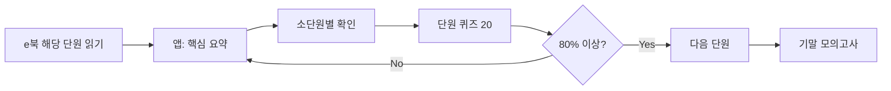

# 중1 학습 앱 — APP 기획서 (v2)

> **기준 문서:** `docs/gemini-code-1780039929126.md` (기술·가정 ① 전단원 요약 + 기출형 120문항)  
> **보조 문서:** `docs/학습자료_취합.md` (교과·출판·e북·도덕 ①)  
> **작성 목적:** e북 추출 데이터 중심의 현 구조를 버리고, **검증된 핵심 요약 + 규격화된 문제 DB**를 중심으로 앱을 재설계한다.

---

## 1. 제품 정의

### 1.1 한 줄 소개

**중학교 1학년 기말고사 대비**를 위한 모바일 웹(PWA) 학습 앱. 교과서 e북은 **본문 열람**용, 앱은 **핵심 요약 → 단원 퀴즈 → 기말 모의고사**에 집중한다.

### 1.2 타깃 사용자

| 구분 | 니즈 |
|------|------|
| **학생** | 단원별 핵심만 빠르게 암기, 4지선다로 실전 감각 익히기 |
| **학부모** | 교과서와 맞는 범위인지 확인, 진도·오답 파악 |
| **교사(선택)** | 단원별 20문항 풀을 수업·과제로 활용 |

### 1.3 1차 MVP 범위 (명확히 제한)

| 포함 | 제외 (2차 이후) |
|------|----------------|
| **기술·가정 ①** (천재, 2022 개정) 6대단원 | 도덕 ① 전면 재구축 (별도 콘텐츠 확보 후) |
| PART 1 요약 + PART 2 문항 120개 | AI 튜터, 소셜, 계정 동기화 |
| 단원 퀴즈 · 단원별 20문항 · 기말 모의고사 | 영상·AR, 교사 대시보드 |

> **도덕 ①**은 홈 카드·라우트는 유지하되, 기술·가정 데이터 정비가 끝난 뒤 동일 스키마로 이관한다.

---

## 2. 콘텐츠 설계 (Gemini DB = Single Source of Truth)

### 2.1 콘텐츠 2계층

```
PART 1. 핵심 요약 (Summary)     →  학습 카드·불릿 정리
PART 2. 문제 DB (Quiz)          →  단원 20문항 × 6 = 120문항
```

| 대단원 ID | 교과서 대단원 | 소단원(요약 섹션) | 문항 수 |
|-----------|---------------|-------------------|---------|
| `unit1` | Ⅰ. 청소년의 발달과 인간관계 | 01 발달 / 02 성·관계 | 20 |
| `unit2` | Ⅱ. 청소년의 의식주 생활과 건강 | 01 영양 / 02 의생활 / 03 주거 | 20 |
| `unit3` | Ⅲ. 청소년의 자기 관리와 주도적인 삶 | 01 생활문제 / 02 소비 | 20 |
| `unit4` | Ⅳ. 기술과 발명 | 01 기술 / 02 발명·지재권 | 20 |
| `unit5` | Ⅴ. 재료와 제품 설계 및 제작 | 01 재료 / 02 설계·제작 | 20 |
| `unit6` | Ⅵ. 친환경 에너지와 수송 기술 | 01 신재생 / 02 수송·안전 | 20 |

### 2.2 현재 앱과의 차이 (재기획 이유)

| 항목 | 현재 (`src/data/techHome`) | 목표 (Gemini 기준) |
|------|---------------------------|---------------------|
| 요약 | e북 OCR·추출 문장 (띄어쓰기·오타 다수) | 교사·교과서 정합 **핵심 요약** |
| 퀴즈 | 용어 정의 4지선다 위주, 품질 불균일 | **기말고사형** 발문·해설 120문항 |
| 단원당 문항 | 소단원마다 수십 문항 (중복·저품질) | **단원 정확히 20문항** (Q01~Q20) |
| 키워드 | `"있다"`, `"능력"` 등 노이즈 | 개념어·이론가 이름 중심 |
| 기말 모의고사 | 체크 단원에서 **랜덤 추출** | **전 단원 120문항 풀**에서 출제 범위 선택 |

**결론:** `data/ebook-cache/*` 및 e북 기반 자동 생성 퀴즈는 **학습 콘텐츠 소스에서 제외**한다. e북은 링크·쪽수 참고만 유지한다.

---

## 3. 정보 구조 (IA) · 화면 설계

### 3.1 사이트맵

```
/  홈
├── /subject/tech-home              과목 허브
│   ├── /unit/:unitId               대단원 허브 (요약 + 소단원 + [단원 퀴즈 20])
│   │   ├── /section/:sectionId     소단원 학습 (PART 1 요약)
│   │   └── /quiz                   단원 퀴즈 20문항 (순차 or 셔플)
│   └── /exam                       기말 모의고사 (범위 선택 → 20~40문항)
├── /subject/ethics                 (2차: 동일 패턴)
└── /settings                       테마·진도 초기화·오답 노트
```

### 3.2 화면별 역할

#### A. 홈 (`/`)

- 과목 카드: **기술·가정 ①** (6단원 · 120문항 · 진도 %)
- 연속 학습(Streak), PWA 설치 안내
- 도덕: “콘텐츠 준비 중” 또는 기존 데이터 + “Gemini DB 미적용” 배지

#### B. 과목 허브 (`/subject/tech-home`)

- 6개 **대단원 카드** (제목, 소단원 수, 퀴즈 20/20 완료율)
- T셀파 e북 배너 (본문은 외부)
- **기말 모의고사** 진입 (단원 체크리스트)

#### C. 대단원 허브 (`/unit/:unitId`) — **핵심 화면**

| 블록 | 내용 |
|------|------|
| 학습 목표 | 교육과정 성취기준 코드 (예: 9기가01) |
| 핵심 요약 | PART 1 불릿 (소단원 탭 또는 아코디언) |
| 소단원 목록 | 01·02… 각각 → 섹션 학습 페이지 |
| CTA | **[단원 퀴즈 20문항]** · e북 해당 단원 링크 |

#### D. 소단원 학습 (`/section/:sectionId`)

- 요약 본문 + **핵심 용어** 칩
- “이 소단원 관련 문제만 풀기” (해당 섹션 태그 문항 필터, 선택 기능)
- 학습 완료 체크 → 진도 반영

#### E. 단원 퀴즈 (`/unit/:unitId/quiz`)

- 20문항, 4지선다
- 즉시 채점 + 해설
- 종료 시: 점수, 오답 목록 → **오답 노트** 저장

#### F. 기말 모의고사 (`/subject/tech-home/exam`)

- 출제 범위: 단원 다중 선택 (최소 2단원, 기존 `MIN_EXAM_UNITS` 유지)
- 문항 수: 20 (기본) / 40 (선택)
- 제한 시간(선택): 25분 / 50분
- 결과: 단원별 정답률, 취약 소단원 추천

#### G. 오답 노트 (`/settings` 또는 `/review`)

- 틀린 문항만 재풀이
- localStorage 기반 (계정 없음)

### 3.3 학습 플로우 (권장 순서)



---

## 4. 데이터 모델

### 4.1 JSON 스키마 (Gemini → 앱)

Gemini 문서 필드를 그대로 매핑한다.

```typescript
// packages/types/content.ts (제안)

export type SummarySection = {
  id: string;           // "u1-s01"
  unitId: string;       // "unit1"
  order: number;        // 1
  title: string;        // "01. 청소년의 발달"
  bullets: string[];    // PART 1 불릿 배열
  keywords: string[];   // ["성장 급등", "2차 성징", "형식적 조작기"]
};

export type Question = {
  id: string;           // "unit1-q01"
  unitId: string;
  sectionId?: string; // 소단원 매핑 (파싱 시 부여)
  order: number;        // 1..20
  stem: string;         // 발문
  choices: { id: string; text: string }[];  // ①→a, ②→b ...
  correctChoiceId: string;
  explanation: string;  // 해설
  difficulty?: "basic" | "applied";
  tags?: string[];      // ["피아제", "2차성징"]
};

export type UnitContent = {
  id: string;
  title: string;
  curriculumCodes: string[];
  textbookPages?: string;
  sections: SummarySection[];
  questions: Question[];  // length === 20
};

export type TechHomeContent = {
  meta: {
    subject: "tech-home";
    grade: 1;
    publisher: "천재교육";
    curriculum: "2022";
    questionCount: 120;
    version: string;      // "2026-05-gemini-v1"
  };
  units: UnitContent[];
};
```

### 4.2 파일 배치 (제안)

```
data/
  tech-home/
    meta.json
    unit1.json          // sections + questions[20]
    ...
    unit6.json
scripts/
  import-gemini-md.ts   // gemini-code MD → JSON 1회 변환
src/
  data/techHome/        // JSON import 또는 생성된 TS
```

### 4.3 기존 타입과의 호환

현재 `Lesson` + `Quiz[]` 구조는 **Section + Question**으로 대체한다.

| 기존 | 신규 |
|------|------|
| `Unit.lessons[]` | `UnitContent.sections[]` |
| `Lesson.points[]` | `SummarySection.bullets[]` |
| `Lesson.quizzes[]` | `UnitContent.questions[]` (단원 레벨) |
| `Quiz.question` | `Question.stem` |
| `Quiz.correctId` | `Question.correctChoiceId` |

라우트는 `lesson/:lessonId` → `section/:sectionId`로 rename (리다이렉트 1버전 유지 가능).

---

## 5. 기능 명세

### 5.1 Must Have (MVP)

| ID | 기능 | 설명 |
|----|------|------|
| F01 | 핵심 요약 뷰 | PART 1 전문 표시, 소단원 구분 |
| F02 | 단원 퀴즈 20 | Gemini Q01~Q20, 해설 포함 |
| F03 | 진도 저장 | 단원 퀴즈 완료, 섹션 열람 (localStorage) |
| F04 | 기말 모의고사 | 선택 단원에서 20/40문항 출제 |
| F05 | 오답 노트 | 틀린 문항 ID 저장·재풀이 |
| F06 | e북 링크 | T셀파 (과목·단원) |
| F07 | PWA | 오프라인 캐시 (정적 자산 + JSON) |

### 5.2 Should Have

| ID | 기능 |
|----|------|
| F08 | 섹션별 미니 퀴즈 (해당 sectionId 태그 3~5문항) |
| F09 | 단원별 성취 배지 (20문항 16개 이상) |
| F10 | 셔플·순차 모드 선택 |
| F11 | 인쇄/PDF용 요약보내기 |

### 5.3 Could Have

- 도덕 ① Gemini급 DB 연동
- 학습 리마인더 (Notification API)
- 다크모드 (일부 구현됨 → 통일)

---

## 6. UI/UX 가이드

### 6.1 톤 & 매너

- **학생 친화적·교실용**: 장식 최소, 가독성 우선
- 과목 색: 기술·가정 `#0d9488` (teal) 유지
- 한 화면에 **요약 → 퀴즈 CTA**가 보이도록 스크롤 길이 제한 (아코디언)

### 6.2 퀴즈 UX

| 상태 | UI |
|------|-----|
| 풀이 중 | 선지 4개, 선택 시 잠금 없음 (제출 전 변경 가능) |
| 제출 후 | 정답 초록 / 오답 빨강 + 해설 펼침 |
| 단원 완료 | 원형 점수 (16/20=80% 합격선 표시) |

### 6.3 접근성

- 선지 번호 `①` → 스크린리더용 `1번` 병기
- 키보드 포커스, 충분한 터치 영역 (44px+)

---

## 7. 기술 스택 (유지)

| 영역 | 선택 |
|------|------|
| 프레임워크 | React + Vite + TypeScript |
| 라우팅 | react-router-dom v6 |
| 상태 | localStorage hooks (`useProgress`, `useStreak`) |
| 배포 | GitHub Pages / 정적 호스팅 |
| 데이터 | 정적 JSON/TS (서버 없음) |

---

## 8. 구현 로드맵

### Phase 0 — 데이터 이관 (1~2일)

1. `scripts/import-gemini-md.ts` 작성: `gemini-code-1780039929126.md` 파싱
2. `data/tech-home/unit*.json` 생성 (120문항 검증)
3. 소단원 `sectionId` 매핑 테이블 (수동 1회)

### Phase 1 — IA·라우트 개편 (2~3일)

1. `UnitStudyPage` → 대단원 허브 (요약 + 퀴즈 CTA)
2. `SectionStudyPage` 신설
3. `UnitQuizPage` — 단원 20문항 전용
4. 기존 `LessonPage` / e북 추출 퀴즈 **제거 또는 리다이렉트**

### Phase 2 — 학습 기능 (2일)

1. 오답 노트 (`useWrongAnswers`)
2. 기말 모의고사 풀을 **Gemini 120문항**으로 교체
3. 진도 키: `tech-home:unit1:quiz` 등 단원 단위

### Phase 3 — 도덕·마무리 (별도)

1. 도덕 ① 콘텐츠 확보 후 동일 파이프라인
2. QA: 문항·정답·해설 교차 검수

---

## 9. 품질·검수 체크리스트

- [ ] 6단원 × 20문항 = **정확히 120문항**
- [ ] 각 문항 **정답 번호 ↔ 해설** 일치
- [ ] PART 1 요약과 PART 2 발문 **용어 일치** (예: 성장 급등, 나-전달법)
- [ ] 선지 4개, 중복·빈 선지 없음
- [ ] e북 페이지 범위와 단원 매핑 표기 (`textbookPages`)
- [ ] 오프라인에서 JSON 로드 확인

---

## 10. 성공 지표 (출시 후)

| 지표 | 목표 |
|------|------|
| 단원 퀴즈 완료율 | 활성 사용자 50%+ 가 3단원 이상 완료 |
| 기말 모의고사 재응시 | 1인당 시험 기간 내 2회+ |
| 평균 정답률 | 70% 전후 (너무 높으면 난이도, 너무 낮으면 요약 보강) |

---

## 11. 부록: Gemini 문항 → 소단원 매핑 (초안)

| 단원 | Q 범위 | 소단원 |
|------|--------|--------|
| unit1 | Q01~Q10 | 01 청소년의 발달 |
| unit1 | Q11~Q20 | 02 건강한 성·인간관계 |
| unit2 | Q01~Q07 | 01 영양·식생활 |
| unit2 | Q08~Q13 | 02 의생활 |
| unit2 | Q14~Q20 | 03 주거 |
| unit3 | Q01~Q10 | 01 생활문제·중독 |
| unit3 | Q11~Q20 | 02 소비 |
| unit4~6 | (구현 시 MD 기준 분할) | 교과서 소단원 순 |

> 매핑은 import 스크립트에 `questionRanges` 설정으로 관리한다.

---

## 12. 다음 액션 (개발 착수 순서)

1. **Gemini MD → JSON 변환 스크립트** 실행 및 120문항 검증  
2. `src/data/techHome/*.ts` 를 JSON 기반으로 **전면 교체**  
3. 라우트·페이지 IA 개편 (섹션 학습 + 단원 퀴즈)  
4. e북 추출 퀴즈·캐시 의존 코드 제거  
5. 도덕 ①은 동일 기획으로 콘텐츠 확보 후 2차 적용  

---

*이 문서는 `gemini-code-1780039929126.md`를 앱의 단일 콘텐츠 소스로 삼는 v2 기획입니다. 구현 단계에서 세부 UI mockup이 필요하면 별도 `docs/wireframes/`를 추가합니다.*
